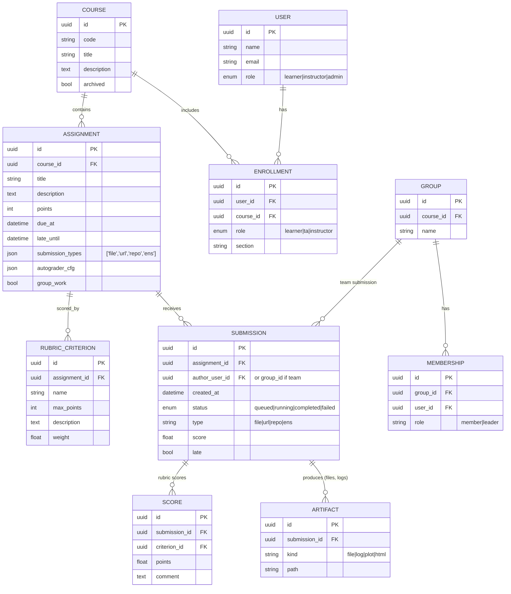

# Basic Data Model (Major Nouns)

## ENS (Executable Notebook Submission) Additions

- `ASSIGNMENT.autograder_cfg`: container image, dependencies, public/hidden tests, time/memory limits, parameters.
- `ARTIFACT.kind`: include `notebook_html`, `stdout`, `stderr`, `plots`.
- Optional `SUBMISSION.runtime_metrics`: exec time, memory peak.
