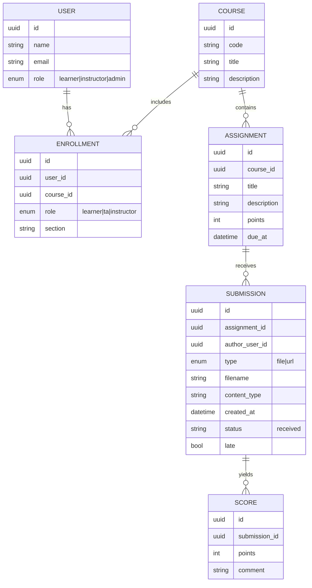

# Basic Data Model (Major Nouns)

## Notes

- **Notebook files (`.ipynb`)** are accepted as **File** uploads and are **not executed** in this prototype.
- The UI surfaces notebooks with a small “Notebook” badge (based on file extension).
- Future (out of scope): executing notebooks, auto-grading, richer feedback artifacts.
