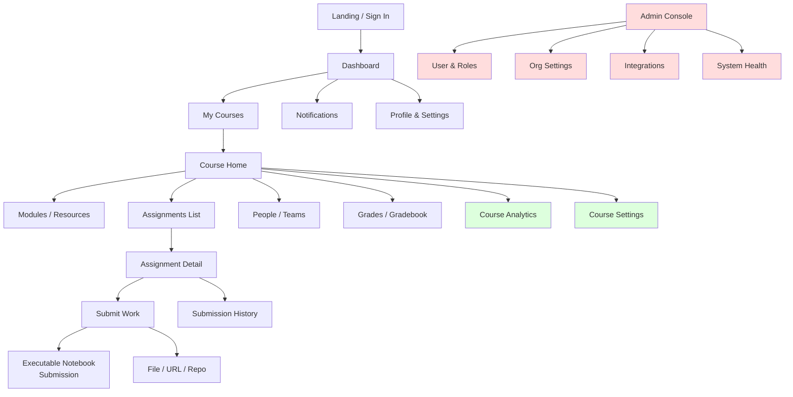

# Site Map (Frontend Pages)

```mermaid
flowchart TD
    Landing[Landing / Sign In] --> Dashboard[Dashboard]
    Dashboard --> MyCourses[My Courses]
    Dashboard --> Notifications[Notifications]
    Dashboard --> Profile[Profile & Settings]

    MyCourses --> CourseHome[Course Home]
    CourseHome --> Modules[Modules / Resources]
    CourseHome --> Assignments[Assignments List]
    CourseHome --> People[People / Teams]
    CourseHome --> Grades[Grades / Gradebook]

    Assignments --> AssignmentDetail[Assignment Detail]
    AssignmentDetail --> SubmitWork[Submit Work]
    SubmitWork --> ENS[Executable Notebook
    Submission]
    SubmitWork --> FileUpload[File / URL / Repo]
    AssignmentDetail --> SubHistory[Submission History]

    CourseHome --> Analytics[Course Analytics]:::instructor
    CourseHome --> Manage[Course Settings]:::instructor

    Admin[Admin Console]:::admin --> Users[User & Roles]:::admin
    Admin --> Orgs[Org Settings]:::admin
    Admin --> Integrations[Integrations]:::admin
    Admin --> SystemHealth[System Health]:::admin

classDef admin fill:#fdd;
classDef instructor fill:#dfd;
```
