# Wireframes (Major Screens)

> Low-fidelity wireframes using Mermaid. Boxes represent major UI regions/components.

---

## 1) Dashboard

---

## 2) Course Home

---

## 3) Assignment Detail

---

## 4) Submission Modal (with ENS)

---

## 5) Web Grader (Instructor)

---

## 6) Gradebook

```mermaid
flowchart TB
  subgraph GRADEBOOK
    A[Filters: section, assignment, status]
    B[Grid: students × assignments]
    C[Cell: score, late flag, comment icon]
    D[Export CSV]
  end
  A --> B
  B --> C
  B --> D
```

